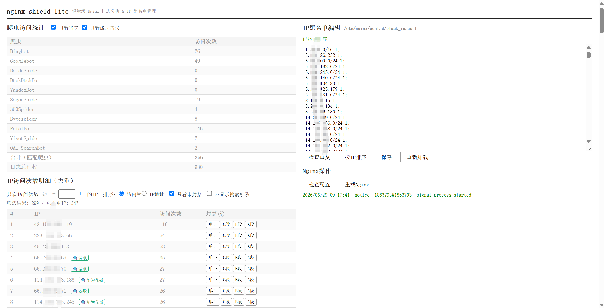

# Nginx Shield Lite

一款无任何依赖的单py文件Nginx日志分析 & IP黑名单管理Web应用程序。



## 功能

- **爬虫统计** — 识别 9 大搜索引擎爬虫（Google、Bing、百度、DuckDuckGo、Yandex、Naver、搜狗、360、神马），支持"仅当天"和"仅成功请求"筛选
- **IP 访问次数** — 去重统计每个 IP 的访问次数，可调阈值、按访问量或 IP 地址排序
- **黑名单编辑** — 在线编辑 Nginx `geo` 黑名单，支持重复检测、IP 排序、一键保存
- **Nginx 操作** — 浏览器内执行配置检查（`nginx -t`）和重载（`nginx -s reload`）
- **一键封禁** — 在访问统计表中直接将 IP 加入黑名单

## 零依赖

仅使用 Python 3 标准库, 无需任何框架，直接运行，开箱即用。

## 快速开始

```bash
# 1. 修改 main.py 顶部配置
LOG_PATHS = ["/var/log/nginx/access.log", "/var/log/nginx/access.log.1"]
BLACKLIST_PATH = "/etc/nginx/conf.d/black_ip.conf"
PORT = 9999

# 2. 启动（重启）
bash restart.sh

# 3. 浏览器访问
http://你的服务器IP:9999
```

## Nginx 配置

本工具基于 Nginx 自带的 `geo` 模块实现 IP 黑名单（无需安装任何插件），相比传统 `deny` 方式，`geo` 使用哈希查找，在大规模黑名单下性能更优。

### 1. 定义 geo 黑名单

在 `nginx.conf` 的 `http` 块顶部中添加：

```nginx
http {
    geo $blacklisted_ip {
        default 0;
        include conf.d/black_ip.conf;
    }
}
```

### 2. 在 server 块中拦截

在每个需要防护的 `server` 块顶部中添加：

```nginx
server {
    if ($blacklisted_ip) {
        return 444;   # 直接断开连接，不返回任何内容
    }
    # ...
}
```

### 3. 黑名单文件格式

`black_ip.conf` 中每行一条规则，格式为 `IP/CIDR 1;`：

```
8.228.46.180 1;
14.29.109.0/24 1;
14.116.236.0/24 1;
```

- 单个 IP：`8.228.46.180 1;`
- IP 段（CIDR）：`14.29.109.0/24 1;`
- 末尾的 `1` 表示命中（对应 `geo` 中 `default 0`，非黑名单为 0，命中为 1）

编辑保存后，在页面点击「检查配置」→「重载Nginx」即可生效。

## 工作原理

```
Nginx access.log
       │
       ▼
  ┌──────────┐   HTTP API    ┌──────────┐
  │  main.py │◄──────────────│ browser  │
  │ (port    │──────────────►│   UI     │
  │  9999)   │   JSON data   │          │
  └──────────┘               └──────────┘
       │
       ├── 读写 ──────────► black_ip.conf
       └── subprocess ────► nginx -t / nginx -s reload
```

## 许可证

MIT

## 致谢

本项目来源于[曼波资源站](https://manbohub.com)